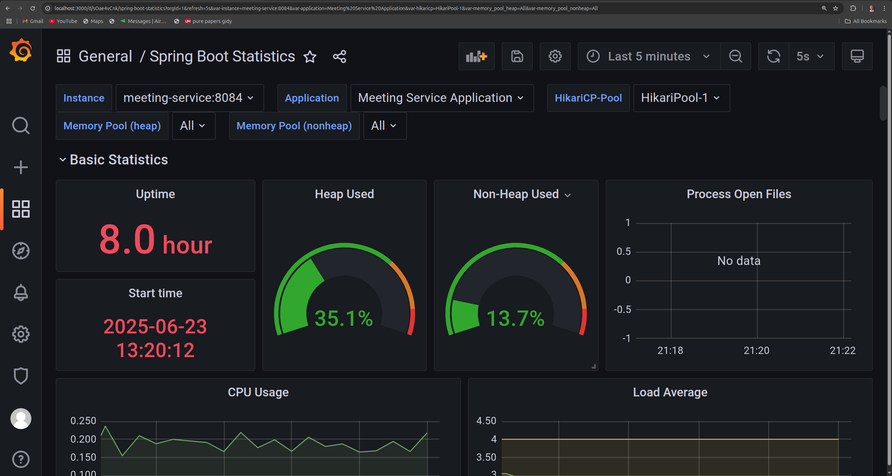
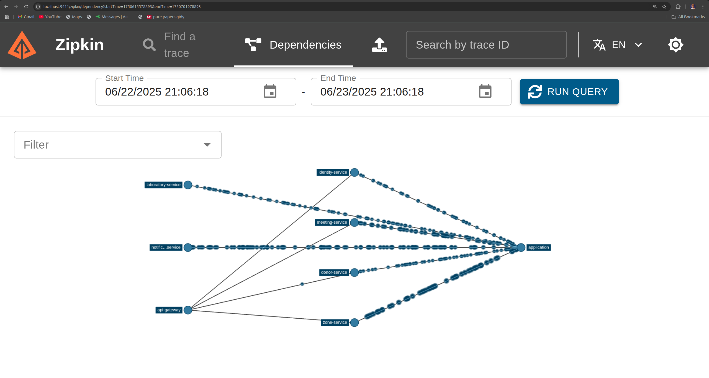
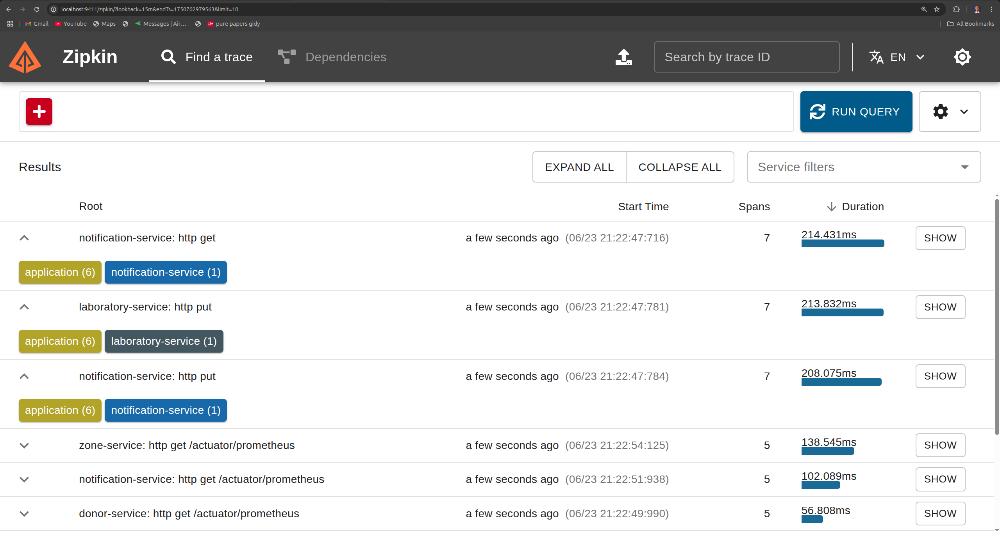
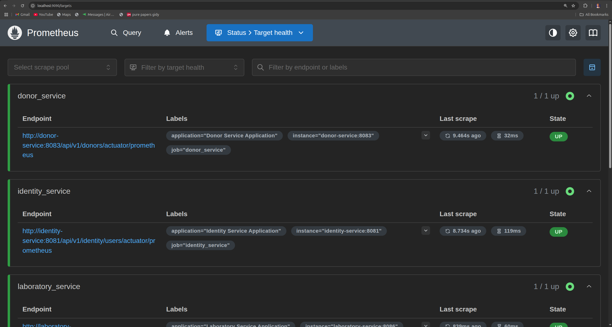
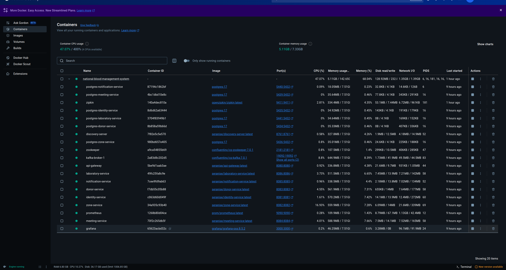

# National Blood Transfusion Service Management System (NBT-SMS)

A centralized, scalable, and secure microservice-based platform for managing blood transfusion services across all zones in Tanzania.

## 🚀 Overview

The NBT-SMS project aims to modernize and centralize blood donation and transfusion services by connecting all zones through a unified system. It provides zone-specific services while maintaining a centralized PostgreSQL database, secured microservices, monitoring, and event-driven communication.

The system is built with:

- **Spring Boot Microservices**
- **Docker & Docker Compose**
- **Kubernetes (K8s) for container orchestration**
- **Kafka for event-driven communication**
- **Prometheus & Grafana for monitoring**
- **Zipkin for distributed tracing**
- **PostgreSQL databases for each microservice**

---

## 🛠️ Tech Stack

- **Backend:** Spring Boot (Java)
- **Databases:** PostgreSQL
- **Communication:** Kafka, Eureka Service Discovery
- **Monitoring:** Prometheus, Grafana
- **Tracing:** Zipkin
- **Containerization:** Docker
- **Orchestration:** Kubernetes

---

## 📦 Project Structure

Each microservice is fully containerized and follows the single-responsibility principle:

- `donor-service`
- `identity-service`
- `zone-service`
- `meeting-service`
- `notification-service`
- `laboratory-service`
- `discovery-server` (Eureka)
- `api-gateway`

Infrastructure services include:

- `postgres-*` databases per service
- `kafka-broker` & `zookeeper`
- `zipkin`, `prometheus`, `grafana`

---

## ⚙️ Getting Started

### Prerequisites

- [Docker](https://docs.docker.com/get-docker/)
- [Docker Compose](https://docs.docker.com/compose/)
- [Kubernetes (Optional for K8s deployment)](https://kubernetes.io/docs/tasks/tools/)

## 💡 Docker Resource Requirements

To ensure all microservices and infrastructure containers run smoothly, please make sure Docker Desktop (or your Docker Engine) is assigned **at least 8 GB of RAM**.

### How to increase Docker memory:

- **On Docker Desktop (Windows/Mac):**

    1. Open Docker Desktop.
    2. Go to **Settings** (gear icon).
    3. Navigate to **Resources** > **Advanced**.
    4. Adjust the **Memory** slider to at least **8 GB**.
    5. Click **Apply & Restart**.

- **On Linux:**

  Docker uses the host’s resources directly. Ensure your machine has enough free memory (8 GB+) and close other heavy applications if needed.

---

Failure to allocate sufficient memory may cause containers to crash or restart frequently.

### Environment Setup

1. **Clone the repository:**

   ```bash
   git clone https://github.com/McharoLabs/national-blood-management-system.git
   cd national-blood-management-system
   ```

2. **Create .env file:**

    Use the provided **.env.example** to set the environment variables
    ```
    cp .env.example .env
   ```

## ⚠️ Important Notes

- This system uses **Beem Africa** as the SMS service provider.
- You must request and configure a valid **Sender Name** with Beem for SMS delivery.
- The following environment variables are required for SMS integration:

  ```env
  SMS_USERNAME=
  SMS_PASSWORD=
  SMS_SOURCE=
  SMS_URL=https://apisms.beem.africa/v1/send
  ```
  ## 🌐 Useful Links

- [Beem Africa Official Website](https://beem.africa/)
- [Beem SMS API Documentation](https://docs.beem.africa/)


Fill in the required values for databases, Kafka, Eureka, SMS, etc

## 🐳 Docker Deployment
Start all services using Docker Compose
```shell
docker compose up -d
```

Check running containers:
```shell
docker ps
```

## 📊 Monitoring & Tracing

- **Prometheus:** [http://localhost:9090](http://localhost:9090)
- **Grafana:** [http://localhost:3000](http://localhost:3000)  
  Default login: `admin / password`
- **Zipkin (Tracing):** [http://localhost:9411](http://localhost:9411)
---

## 📊 Monitoring & Tracing Dashboards

Visualizing system health and tracing distributed calls is crucial for monitoring our microservices.

---

### Grafana Dashboard

Below is the Grafana dashboard showing key metrics and system health status:



---

### Zipkin Dependency Graph

This image shows the Zipkin dependency graph illustrating service relationships and call flow:



---

### Zipkin Trace View

Example of a Zipkin trace showing detailed timing and spans for requests across microservices:



---

### Prometheus Metrics

Prometheus metrics page displaying real-time system metrics collected from services:




### Prometheus Metrics

Prometheus metrics page displaying real-time system metrics collected from services:


---
## Docker Running containers

Docker running containers showing CPU usage and Container memory usage



## 📊 Access Points (Example)

After deploying the system to Kubernetes, you can access the following services using the cluster's external IP:

| Service           | Access Method                   |
|-------------------|---------------------------------|
| **Eureka Server** | `http://<external-ip>:8761`    |
| **API Gateway**   | `http://<external-ip>:8080`    |
| **Prometheus**    | `http://<external-ip>:9090`    |
| **Grafana**       | `http://<external-ip>:3000`    |
| **Zipkin**        | `http://<external-ip>:9411`    |

Replace `<external-ip>` with your cluster's public IP or domain name as configured in your Ingress or LoadBalancer.

---


---

## 📄 License

This project is licensed under the [MIT License](LICENSE). You are free to use, modify, and distribute this software under the terms of the MIT license.

---

## 🙏 Acknowledgements

- [Spring Boot](https://spring.io/projects/spring-boot)
- [Docker](https://www.docker.com/)
- [Kubernetes](https://kubernetes.io/)
- [Kafka](https://kafka.apache.org/)
- [Prometheus](https://prometheus.io/)
- [Grafana](https://grafana.com/)
- [Zipkin](https://zipkin.io/)
- [Beem Africa - SMS Provider](https://beem.africa/)

---

## 📧 Contact

For inquiries, support, or contributions:

**McharoLabs**  
[https://github.com/McharoLabs](https://github.com/McharoLabs)  


